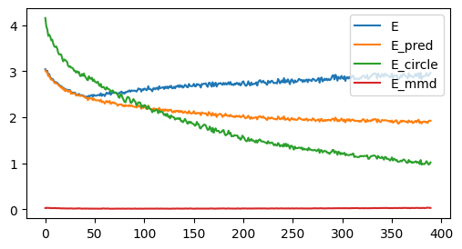
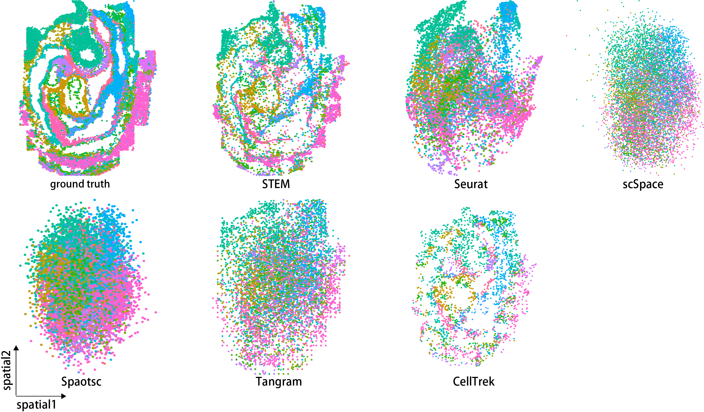

# <a href='https://github.com/WhirlFirst/STEM'></a>

# Welcome!

## 1. Introduction and installation
STEM is a powerful tool for building single-cell level spatial transcriptomic landscapes using SC data with ST data. STEM extracts the spatial information from the gene expressions and eliminates the domain gap between spatial transcriptomics and single-cell RNA-seq data.

In this tutorial, we will demonstrate the workflow based on the mouse embryo data as part of our paper Figure 2. Since STEM is a light model, you can use the code from the `STEM` folder directly. We will release the PyPI package soon.
``` python
%pylab inline
import os
os.environ["CUDA_VISIBLE_DEVICES"] = "3"
import scanpy as sc
import pandas as pd
import torch
import scipy
import time
from STEM.model import *
from STEM.utils import *
```

## 2. Load and Preprocess data 
First, we load the simulated ST data as ST data and the raw SeqFISH data as SC data. Then we normalized and log-scaled these data.

``` python
scdata = pd.read_csv('./data/mousedata_2020/E1z2/simu_sc_counts.csv',index_col=0)
scdata = scdata.T
stdata = pd.read_csv('data/mousedata_2020/E1z2/simu_st_counts.csv',index_col=0)
stdata = stdata.T
stgtcelltype = pd.read_csv('./data/mousedata_2020/E1z2/simu_st_celltype.csv',index_col=0)
spcoor = pd.read_csv('./data/mousedata_2020/E1z2/simu_st_metadata.csv',index_col=0)
scmetadata = pd.read_csv('./data/mousedata_2020/E1z2/metadata.csv',index_col=0)

adata = sc.AnnData(scdata,obs=scmetadata)
sc.pp.normalize_total(adata)
sc.pp.log1p(adata)
scdata = pd.DataFrame(adata.X,index=adata.obs_names,columns=adata.var_names)
stadata = sc.AnnData(stdata)
sc.pp.normalize_total(stadata)
sc.pp.log1p(stadata)
stdata = pd.DataFrame(stadata.X,index=stadata.obs_names,columns=stadata.var_names)

adata.obsm['spatial'] = scmetadata[['x_global','y_global']].values
stadata.obsm['spatial'] = spcoor
```
Next we calculate the ratio between the median total counts value of SC and ST data as the dropout rate.
``` python

sc.pp.calculate_qc_metrics(adata,percent_top=None, log1p=False, inplace=True)
adata.obs['n_genes_by_counts'].median()

sc.pp.calculate_qc_metrics(stadata,percent_top=None, log1p=False, inplace=True)
stadata.obs['n_genes_by_counts'].median()

dp = 1- adata.obs['n_genes_by_counts'].median()/stadata.obs['n_genes_by_counts'].median()
#0.5836734693877551
```

## 3. Train the STEM model
We first config the STEM model and then train it. Empirically we found by setting the sigma as half of the ST spot adjacent distance, STEM achieves the best performance.
``` python
class setting( object ):
    pass
seed_all(2022)
opt= setting()
setattr(opt, 'device', 'cuda:0')
setattr(opt, 'outf', 'log/Mouse_E1z2')
setattr(opt, 'n_genes', 351)
setattr(opt, 'no_bn', False)
setattr(opt, 'lr', 0.002)
setattr(opt, 'sigma', 3)
setattr(opt, 'alpha', 0.8)
setattr(opt, 'verbose', True)
setattr(opt, 'mmdbatch', 1000)
setattr(opt, 'dp', dp)

testmodel = SOmodel(opt)
testmodel.togpu()
loss_curve = testmodel.train_wholedata(400,torch.tensor(scdata.values).float(),torch.tensor(stdata.values).float(),torch.tensor(spcoor.values).float())
```
The loss curve will be like this:


## 4. Get embeddings and reconstruct spatial adjacency
We first get the embeddings and build the mapping matrix 
We first get the embeddings and build the mapping matrix 
``` python
testmodel.modeleval()
scembedding = testmodel.netE(torch.tensor(scdata.values,dtype=torch.float32).cuda())
stembedding = testmodel.netE(torch.tensor(stdata.values,dtype=torch.float32).cuda())
netst2sc = F.softmax(stembedding.mm(scembedding.t()),dim=1).detach().cpu().numpy()
netsc2st = F.softmax(scembedding.mm(stembedding.t()),dim=1).detach().cpu().numpy()
```
The matrix `netst2sc` and `netsc2st` are ST-SC and SC-ST mapping matrices, respectively. In the ST-SC mapping matrix, the probability of one spot to other cells summarizes to 1. In the SC-ST mapping matrix, the probability of one cell to other spots summarizes to 1.

Then we can get the spatial coordinate for every single cell.
```python
adata.obsm['spatialDA'] = all_coord(pd.DataFrame(netsc2st,index=adata.obs_names,columns=stadata.obs_names),spcoor)
```
Compared with other methods, STEM is the only method that preserves the original topology structure of all single cells.
